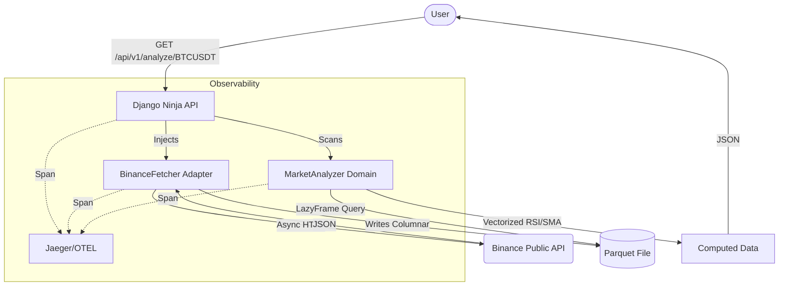

# High-Performance Quant Data Ingestion MVP

## Overview
This MVP demonstrates a production-grade, high-performance quantitative data pipeline. It leverages **Hexagonal Architecture** to decouple core trading logic from delivery mechanisms, uses **Polars** for vectorized computation, and ensures **Observability** via OpenTelemetry and Jaeger.

## Architecture



## Design Decisions

### 1. Hexagonal Architecture (Ports & Adapters)
- **Why**: By isolating the math logic in `core/domain`, we can run the same strategy via a CLI, a WebSocket consumer, or this Django API without changing a line of business logic.
- **Benefit**: System testability and framework independence.

### 2. Polars & LazyFrames
- **Why**: Traditional Pandas loads everything into RAM and is single-threaded. Polars uses Apache Arrow, multi-threading, and **Lazy Evaluation**.
- **Benefit**: The `MarketAnalyzer` builds an execution graph and optimizes it (e.g., predicate pushdown) before a single row is processed, drastically reducing latency and memory footprint.

### 3. Parquet Persistence
- **Why**: Binary, columnar storage format.
- **Benefit**: Extremely fast read-access for specific columns (price/volume) compared to CSV or SQLite, providing the industry standard for high-bandwidth quant research.

### 4. Zero-Trust Observability (OTEL)
- **Why**: You can't optimize what you can't measure. 
- **Benefit**: Using OpenTelemetry spans, we can prove through **Jaeger** that local Polars computation (5ms) is negligible compared to network I/O (300ms), identifying the true bottlenecks.

## ⚡ How to Run

1. **Start the Infrastructure**:
   ```bash
   docker-compose up -d
   ```
   *This spins up the Django app + Jaeger instance.*

2. **Trigger the Analysis**:
   - URL: `http://localhost:8000/api/v1/analyze/BTCUSDT`
   - This will fetch 10,000 klines, calculate indicators, and return JSON.

3. **Check the Traces**:
   - Jaeger UI: `http://localhost:16686`
   - Filter by Service: `quant_django_api` to see the performance breakdown.

---

*Built for high performance. Optimized for scale.*
